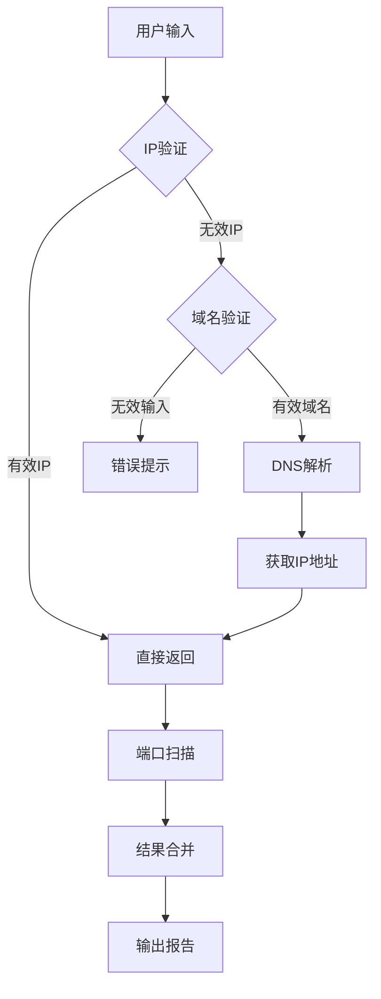
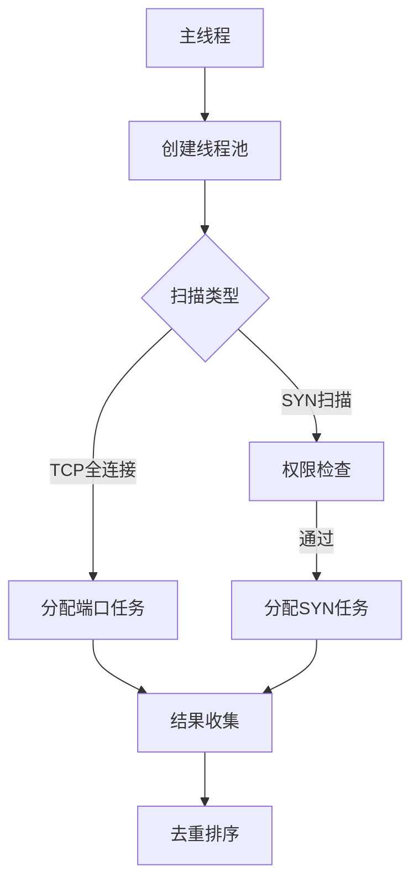

# 端口探测设计文档

## 1. 概述
本工具包含两个独立模块，用于实现IP地址/域名解析和端口扫描功能。主要包含以下功能：
- 输入验证与IP地址解析
- 常见端口扫描（支持两种扫描方式）

## 2. 模块设计

### 2.1 IP地址处理模块 (get_ip.py)

#### 2.1.1 功能说明
1. 验证输入是否为合法IP地址
2. 验证输入是否为合法域名
3. 域名到IP地址的转换
4. 支持包含HTTP/HTTPS前缀的URL处理

#### 2.1.2 函数说明

```python
def is_ip(input_str)
```
- **功能**：验证字符串是否为有效IP地址
- **实现**：使用ipaddress库的ip_address方法进行验证
  ```python
  ipaddress.ip_address(input_str)
  ```
- **返回值**：布尔值

```python
def is_domain(input_str)
```
- **功能**：验证字符串是否符合域名格式规范
- **实现**：正则表达式匹配（符合以下规则）：
  - 由字母数字和"-"组成
  - 每级域名长度不超过63字符
  - 顶级域名至少2个字母
  ```python
  domain_pattern = r'^([a-zA-Z0-9]([a-zA-Z0-9-]{0,61}[a-zA-Z0-9])?\.)+[a-zA-Z]{2,}$'
  ```
- **返回值**：布尔值

```python
def domain_to_ip(domain)
```
- **功能**：域名解析为IP地址
- **实现**：使用socket.gethostbyname
  ```python
  return socket.gethostbyname(domain)
  ```
- **异常处理**：捕获socket.gaierror错误
- **返回值**：IP字符串或None

```python
def get_ip(input_str)
```
- **功能**：主处理函数
- **处理流程**：
  1. 处理HTTP/HTTPS前缀
  2. 优先尝试IP地址验证
  3. 域名格式验证
  4. 域名解析
- **返回值**：有效IP地址或None


### 2.2 端口扫描模块 (port.py)

#### 2.2.1 功能说明
1. 多线程并发端口扫描
2. 支持TCP全连接与SYN半开放双扫描模式
3. 自动检测系统权限并选择可用扫描方式
4. 支持IPv4/IPv6双协议栈
5. 可配置化扫描参数（端口范围/超时时间）
6. 扫描结果自动去重与排序

#### 2.2.2 函数说明

```python
def check_permission()
```
- **功能**：验证系统管理员权限
- **关键实现**：
  ```python
  # Windows权限检测
  ctypes.windll.shell32.IsUserAnAdmin()
  # Linux/macOS权限检测
  os.getuid() == 0
  ```
- **实现原理**：
  - Windows系统调用shell32 API检测管理员会话
  - Unix-like系统通过用户ID验证root权限

```python
def tcp_connect_scan(ip, port)
```
- **功能**：执行TCP全连接扫描
- **关键实现**：
  ```python
  # 协议版本检测
  ip_obj = ipaddress.ip_address(ip)
  # IPv6 socket创建
  socket.socket(socket.AF_INET6, socket.SOCK_STREAM)
  # 连接状态检测
  response = s.connect_ex((ip, port))
  ```
- **技术细节**：
  - 通过`connect_ex()`返回0值判断端口开放
  - 显式调用`s.close()`立即释放socket资源

```python
def tcp_syn_scan(ip, port)
```
- **功能**：执行SYN半开放扫描
- **关键实现**：
  ```python
  # 随机源端口生成
  sport = RandShort()
  # IPv6 SYN包构造
  IPv6(dst=ip)/TCP(sport=sport, dport=port, flags="S")
  # 响应包标志位验证
  if "S" in flags and "A" in flags:
      return True
  ```
- **技术细节**：
  - 使用Scapy库构造原始数据包
  - 通过SYN-ACK（0x12）标志组合判断端口开放

```python
def port_scan(ip: str) -> list[int]
```
- **功能**：主控制函数
- **关键实现**：
  ```python
  # 线程池初始化
  with ThreadPoolExecutor(max_workers=os.cpu_count()) as executor:
      # 任务分发（全连接扫描）
      executor.map(tcp_connect_scan, [ip]*len(...), PORT_SCAN_RANGE)
  
  # 权限检测与SYN扫描
  if check_permission():
      with ThreadPoolExecutor(...):
          executor.map(tcp_syn_scan, ...)
  
  # 结果合并去重
  open_ports.update(set(...))
  ```
- **并发机制**：
  - 基于CPU核心数动态分配线程数（`os.cpu_count()`）
  - 使用双重集合（set）操作实现结果去重
  - 最终结果按端口号升序排列（sorted()）

## 3. 工作流程



## 4. 技术特点

### 4.1 IP处理模块特点
- 支持多种输入格式（纯IP/域名/URL）
- 严格的格式验证机制
- 自动去除协议前缀

### 4.2 端口扫描模块特点
- 混合扫描模式提升准确性
- 友好的进度提示
- 网络连接及时清理（关闭socket/RST包发送）
- 结果自动去重

#### 4.2.1 协议栈支持矩阵
| 功能模块        | IPv4 | IPv6 |
|-----------------|------|------|
| TCP全连接扫描   | ✔️   | ✔️   |
| SYN半开放扫描   | ✔️   | ✔️   |
| 域名解析        | ✔️   | ✔️   |

#### 4.2.2 多线程架构



## 5. 未来规划
- UDP端口扫描支持
- 分布式扫描架构
- 自动化漏洞关联
- 智能速率控制（QoS规避）